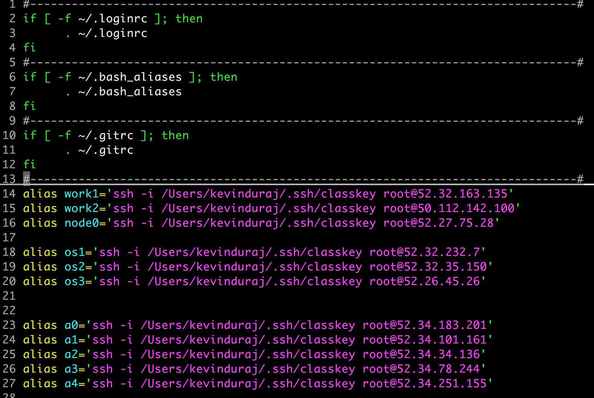
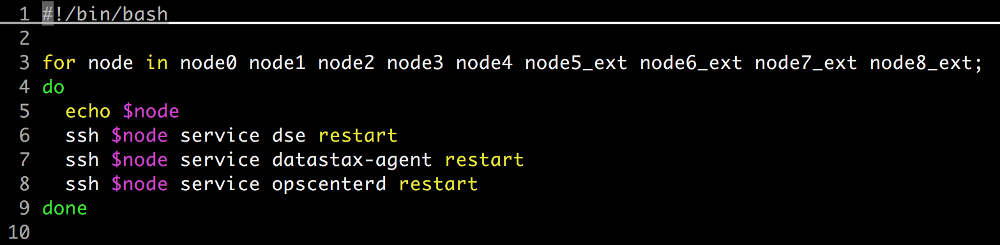

# Please state your name and team member's names. 
* Kevin Duraj

# What are the objectives of this lab/project?
* Add nodes to a cluster 
* Add a node to the cluster using OpsCenter
* Run cleanup on cluster nodes
* Remove a node
* Decommission a node using OpsCenter
* Replace a downed node

# What is your starting point? Please express this in the form of relevant output or screenshots.

# What is your ending point?  Please express this in the form of relevant output or screenshots.

# What was useful about this lab/project for you?

# What are the most important takeaways?
* Knowledge how to manage multiple cluter with multiple nodes


### Logging into the student exercise environment
```
chmod 600 ~/.ssh/classkey
ssh -i ~/.ssh/classkey root@<address>
```


### Create Server Aliases 
```
vi .bash_aliases

alias work1='ssh -i /Users/kevinduraj/.ssh/classkey root@52.32.163.135'                             
alias work2='ssh -i /Users/kevinduraj/.ssh/classkey root@50.112.142.100'
alias node0='ssh -i /Users/kevinduraj/.ssh/classkey root@52.27.75.28'

alias os1='ssh -i /Users/kevinduraj/.ssh/classkey root@52.32.232.7'
alias os2='ssh -i /Users/kevinduraj/.ssh/classkey root@52.32.35.150'
alias os3='ssh -i /Users/kevinduraj/.ssh/classkey root@52.26.45.26'


alias a0='ssh -i /Users/kevinduraj/.ssh/classkey root@52.34.183.201'
alias a1='ssh -i /Users/kevinduraj/.ssh/classkey root@52.34.101.161'
alias a2='ssh -i /Users/kevinduraj/.ssh/classkey root@52.34.34.136'
alias a3='ssh -i /Users/kevinduraj/.ssh/classkey root@52.34.78.244'
alias a4='ssh -i /Users/kevinduraj/.ssh/classkey root@52.34.251.155'
```

### Access nodes from workstation
```
nodetool -h node0 status

```

### Run Performance Test
```
cassandra-stress write n=500000 no-warmup -node node0 -schema replication\(factor=2\)
cassandra-stress read  n=500000 no-warmup -node node0
cassandra-stress read n=500000 cl=quorum no-warmup -node node0
```

### Multi Node Operation
```
#!/bin/bash

for node in node0 node1 node2 node3 node4 node5_ext node6_ext node7_ext node8_ext;
do
  echo $node
  ssh $node nodetool cleanup 
  ssh $node nodetool repair
  ssh $node nodetool status
done
```

### Restart All Datastax Services
```
#!/bin/bash

for node in node0 node1 node2 node3 node4 node5_ext node6_ext node7_ext node8_ext;
do
  echo $node
  ssh $node service dse restart 
  ssh $node service datastax-agent restart
  ssh $node service opscenterd restart
done
```


